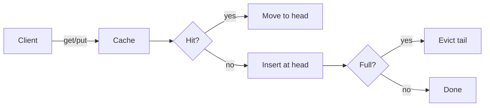

# Acme Cache

A small in-process LRU cache for hot-path lookups. Designed for read-heavy
workloads where the working set fits comfortably in RAM.

## Why another cache library

Most caches optimize for the wrong thing — generality. Acme makes three
deliberate trade-offs:

1. **Single eviction policy** (LRU). No TinyLFU, no ARC. Less code, less tuning.
2. **No persistence.** Restarts lose state. That's a feature: it forces callers
   to think about cold-start latency.
3. **Synchronous only.** Async wrappers belong in your app, not the cache.

## Installation

```bash
pip install acme-cache
```

## Quick start

```python
from acme_cache import Cache

cache = Cache(max_size=1024)
cache.put("hello", "world")
print(cache.get("hello"))   # → "world"
print(cache.stats())        # → CacheStats(hits=1, misses=0, evictions=0)
```

## Architecture



## Comparison

| Library     | Memory   | LOC   | Eviction       | Async |
|-------------|----------|-------|----------------|-------|
| Acme Cache  | Low      | ~400  | LRU            | No    |
| `cachetools`| Medium   | ~2000 | LRU/LFU/TTL    | No    |
| `aiocache`  | High     | ~5000 | Many           | Yes   |

## Roadmap

- [x] Basic LRU implementation
- [x] Statistics tracking
- [x] Thread-safe operations
- [ ] Optional `__sizeof__` hook for memory-bounded mode
- [ ] Benchmark suite against the alternatives
- [ ] Documentation site

## License

MIT.
